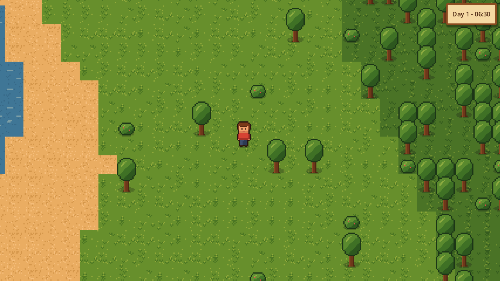

# Leguitz

Jeu 2D en pixel art, en monde ouvert : **explorer, construire, admirer, survivre et combattre**.
Visuellement inspiré de *Stardew Valley*, et de *Minecraft* pour la logique de jeu : monde infini
généré procéduralement, blocs, craft, survie, modes Créatif / Survie / Hardcore.

- Moteur : **Godot 4.7** (GDScript), rendu Forward+ (Vulkan / Direct3D 12 / Metal)
- Plateformes : PC (Windows, Linux, macOS) d'abord, puis iOS et Android
- Langues : français et anglais (réglable dans le jeu)



## État actuel : phase 0 (fondations)

| Fonction | État |
|---|---|
| Architecture « serveur intégré » (solo), prête pour le multijoueur | ✅ |
| Monde infini découpé en chunks de 16×16 tuiles, chargés autour du joueur | ✅ |
| Terrain provisoire (eau, sable, herbe, forêt, roche, neige) à partir d'une graine | ✅ (remplacé en phase 1) |
| Déplacement du joueur avec collisions, clavier (ZQSD/WASD, flèches) et manette | ✅ |
| Caméra fluide, pixel art net, zoom (+ / -) | ✅ |
| Horloge du monde : durée de journée 5 à 120 min, synchronisation avec l'appareil, temps figé | ✅ |
| Rythme de la faim, de la cuisson et des cultures adapté à la durée des journées | ✅ (formule prête, utilisée à partir des phases 4 à 7) |
| Rattrapage hors-ligne en mode synchronisé (limité à 1 journée) | ✅ (calcul prêt, appliqué avec les sauvegardes) |
| Menu pause (temps, langue, zoom), horloge à l'écran, écran de debug (F3) | ✅ |
| Tests automatiques et compilation Windows / Linux / macOS par GitHub | ✅ |

## Jouer

**Version compilée :** onglet *Actions* du dépôt GitHub → dernière exécution de *Build* → section
*Artifacts* : `Leguitz-windows`, `Leguitz-linux` ou `Leguitz-macos`.
Sur macOS, la version n'est pas encore signée : faire clic droit → *Ouvrir* au premier lancement.

**Depuis les sources :** installer [Godot 4.7](https://godotengine.org/download), ouvrir le dossier
du projet, puis appuyer sur F5.

### Contrôles

| Action | Clavier | Manette |
|---|---|---|
| Se déplacer | ZQSD (AZERTY) / WASD (QWERTY), flèches | Stick gauche, croix |
| Courir | Maj | Clic du stick gauche |
| Pause | Échap | Start |
| Zoom | + / - | RB / LB |
| Écran de debug | F3 | Select |

## Développement

```bash
bash tools/install_godot.sh --templates desktop   # installe Godot dans ~/godot
export PATH="$HOME/godot:$PATH"

godot --headless --path . --import                # prépare le projet
godot --headless --path . -s res://tests/run_tests.gd   # tests unitaires
gdlint src tests && gdformat --check src tests    # style (pip install "gdtoolkit==4.*")
python3 tools/gen_placeholder_art.py              # régénère les sprites provisoires
```

Des options de développement se passent après `--` (graine, heure, capture d'écran…) :
voir `src/core/dev_options.gd`. Exemple :

```bash
godot --path . -- --seed=42 --time=21 --debug --lang=fr
```

### Organisation du code

```
src/core/     constantes, coordonnées, hachage déterministe, réglages, contrôles
src/sim/      simulation autoritaire (« serveur ») : monde, chunks, génération, horloge
src/net/      messages et transports (local en solo, réseau plus tard)
src/client/   affichage : chunks, joueur, caméra, jour/nuit
src/ui/       interface : thème, horloge, menu pause, écran de debug
scenes/       scènes Godot
tests/        tests unitaires (lanceur maison, sans dépendance)
tools/        scripts (installation de Godot, génération des sprites)
i18n/         traductions (strings.csv : clé, en, fr)
```

Le client ne modifie jamais le monde directement : il envoie des messages au serveur
(`src/net/msg.gd`), comme dans Minecraft. En solo, le serveur tourne dans le même processus.
Pour le multijoueur, il suffira de brancher un transport réseau.

## Feuille de route

0. ✅ Fondations
1. Génération du monde à la Minecraft (bruits climatiques, biomes, rivières, falaises, grottes, minerais)
2. Visuels et lumière (atelier de sprites, éclairage dynamique, HDR, eau, vent, météo)
3. Joueur et interactions (minage, construction, objets, inventaire)
4. Craft (établi, four, outils, coffres)
5. Survie et combat (vie, faim, animaux, monstres, combat, modes de jeu)
6. Souterrain et structures
7. Agriculture et élevage
8. Finitions PC (menus, sauvegardes, sons, options graphiques, Steam)
9. Mobile (iOS, Android)
