# Leguitz

Jeu en pixel art, en monde ouvert : **explorer, construire, admirer, survivre et combattre**.
Visuellement inspiré de *Stardew Valley* (vue du dessus inclinée), et de *Minecraft* pour la logique
de jeu : monde infini généré procéduralement, blocs, craft, survie, modes Créatif / Survie / Hardcore,
et un mode Arcade à scénarios.
Le monde est rendu en **vraie 3D pixel art** : les blocs sont de vrais cubes texturés en pixel art,
les personnages et les plantes des sprites, avec de vraies ombres et lumières.

- Moteur : **Godot 4.7** (GDScript), rendu Forward+ (Vulkan / Direct3D 12 / Metal)
- Plateformes : PC (Windows, Linux, macOS) d'abord, puis iOS et Android
- Langues : français et anglais (réglable dans le jeu)


## État actuel : phase 7 (agriculture et élevage) en cours

### Phase 7 : agriculture et élevage (en cours)

| Fonction | État |
|---|---|
| Végétation qui pousse : un arbre abattu donne des pousses de son espèce ; plantées, elles deviennent de jeunes arbres puis des arbres à la lumière ; la terre nue reverdit à côté de l'herbe | ✅ |
| Houe, champs et graines : terre labourée humide près de l'eau, blé, carottes et pommes de terre en 4 stades, récolte, pain et pommes de terre cuites au four | ✅ |
| Ciel en 1re personne : levers et couchers de soleil, lune dans sa phase, étoiles et voie lactée, nuages raccord avec leurs ombres | ✅ |
| Réglages d'affichage : plein écran, résolution, écran, synchro verticale, limite d'images (dont 100), compteur d'images, distance de vue, luminosité, taille de l'interface, champ de vision et sensibilité de la souris | ✅ |
| Arrosage et soins : arrosoir en cuivre (rempli à l'eau ou à un évier, 20 cases), la pluie arrose les champs à ciel ouvert, rigoles d'irrigation, composteur et compost (une culture ou une pousse gagne un stade), cultures sous serre et à la lanterne | ✅ |
| Nouvelles cultures : betterave, chou, maïs, tomate, fraise, framboise, lin, citrouille et pastèque (le fruit pousse à côté de la tige), riz en rizière, canne à sucre qui repousse, vigne sur treillis ; cueillette ; arbres fruitiers (pommier, cerisier, oranger, pêcher) en fleur puis en fruits ; plantes sauvages dans le monde | ✅ |
| Élevage : nourrir pour avoir des petits qui grandissent, corde pour mener une bête, enclos, cisailles (laine qui repousse), seau (lait de brebis), pondoir et œufs, affection qui fait donner plus, abris où les bêtes dorment la nuit | ✅ |
| Four d'usine à 4 cuissons : quatre variétés à la fois sur un seul feu (qui brûle plus vite), avec ses coffres « À cuire », « Combustible » et « Cuit » | ✅ |
| Animaux de ferme : vaches et chèvres (lait, cuir), canards qui nagent et pondent, lapins, cochons nés des sangliers de la ferme ; abeilles, nids sauvages et ruches (miel au bocal, rayons aux cisailles ; les cultures proches poussent plus vite) | ✅ |
| Chat (T) et commandes (/), complétées avec Tab : /aide, /joueurs, /mp, /où, /graine, /vide pour tous ; /tp (hasard, départ, un joueur, des coordonnées), /heure, /météo, /mode, /donne, /invoque, /soigne, /admin pour les admins du monde | ✅ |
| Clic molette en 1re personne : le bloc visé en main (en créatif même sans l'avoir ; en survie seulement s'il est dans l'inventaire) | ✅ |
| Performances : en 1re personne rien n'est dessiné au-delà de la brume, ombres et animations épargnées là où elles ne se voient pas, plus d'à-coups de la pousse des plantes ; case « Extrême » (tout au maximum, ses pour et contre au survol) | ✅ |
| Animaux sauvages : loups en meute (chassent moutons et lapins, la nuit le joueur resté dans le noir, se vengent ensemble), ours des taïgas (se dresse pour prévenir, puis charge ; dort la nuit), grenouilles, tortues qui pondent sur les plages (les œufs éclosent), castors qui bâtissent des barrages, poissons dans les rivières et les mers. Ravageurs : taupe qui ronge les cultures par en dessous (taupinières), corbeaux qui picorent les semis (chassés par l'épouvantail), bourdons-lanternes dont la lueur fait pousser les cultures la nuit | ✅ |
| Outils, épées et arc refaits : modèles plus réalistes, l'arc qui se courbe quand on le bande ; en 1re personne le bras droit tient l'objet avec son propre champ de vision (même taille quel que soit le FOV, plus rien ne traverse les murs), coups qui frappent vers le réticule, épée qui tranche ; en 3e personne l'outil dans la vraie main, qui ne passe plus dans la tête | ✅ |
| Cuisine : plan de cuisine (soupe, ragoût, tarte, omelette, gâteau, crêpes, gratin, confiture, tartine, pain de farine ; le seau et le bocal restent dans la grille), moulin (farine), baratte (beurre), tonneau (jus, puis cidre), cave à fromage ; des plats à effets (régénération, rassasié, vivacité, vigueur, adresse) affichés au-dessus de la vitalité | ✅ |
| Pêche : canne (lancer, touche, ferrer), 14 poissons selon l'eau, le climat, l'heure, la pluie et la profondeur, appâts (vers, boulettes, appât de poisson), nasses (écrevisses, crabes), algues et bois flotté, poissons grillés, soupe de poisson, sushis, poisson frit | ✅ |
| Bateau et chantier naval : un chantier sur la rive (portique, treuil, cale qui descend dans l'eau), une coque de 2 à 5 places (poupe, sections, proue), bancs et coffres, moteur à charbon (fumée, hélice, jauge) ou avirons, mise à l'eau et retour au chantier, les animaux menés à la corde montent à bord | ✅ |
| Filet de pêche du bateau (jeté ou relevé à bord, prises dans les coffres, usure, raccommodage) et peinture (huile de lin et pigments, 9 couleurs, coque et bande, la hache décape) | ✅ |
| Chien (un loup apprivoisé avec de la viande) et chat (sauvage, apprivoisé avec du poisson) : suivent, restent ou gardent ; le chien aboie contre les monstres, les mord et chasse les loups, ramène le troupeau ; le chat chasse taupes et corbeaux ; chiots et chatons de plusieurs robes | ✅ |
| Saisons | à venir |


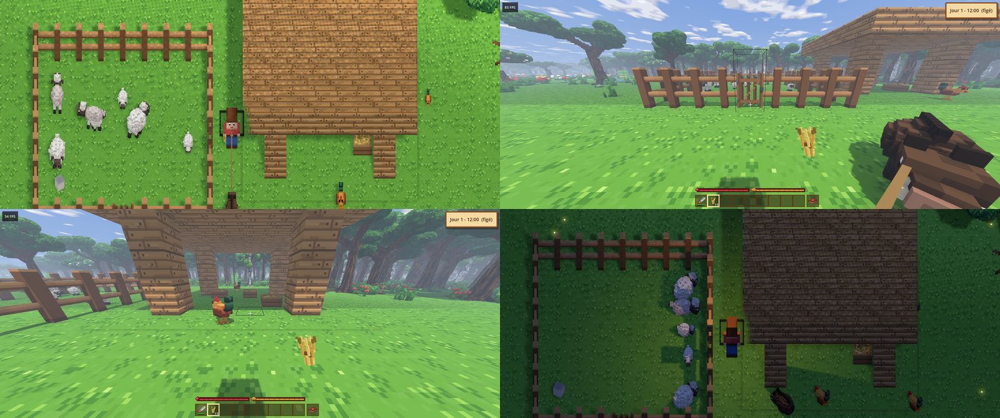

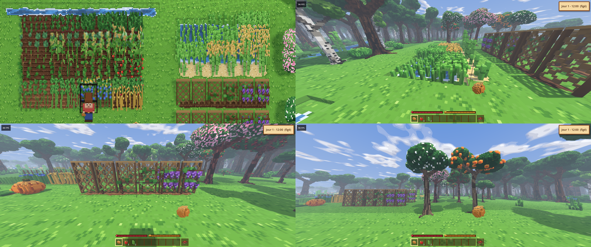

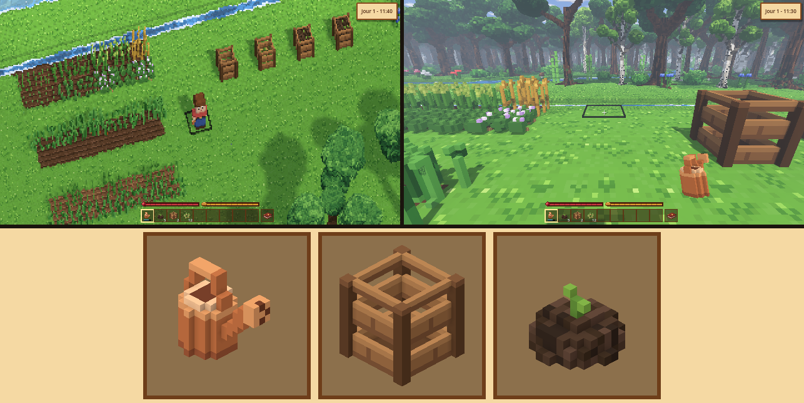

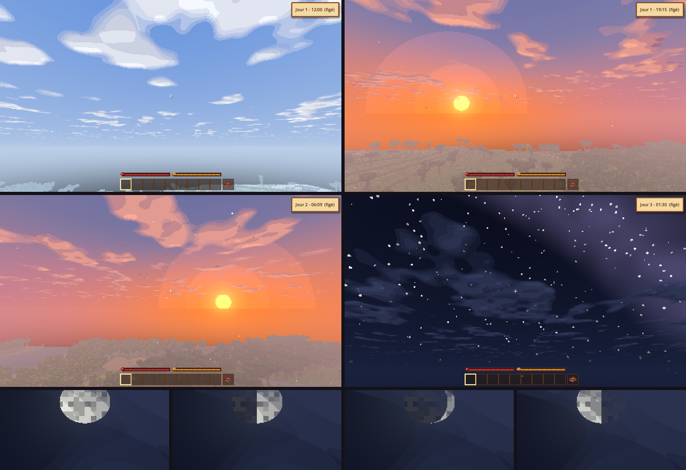

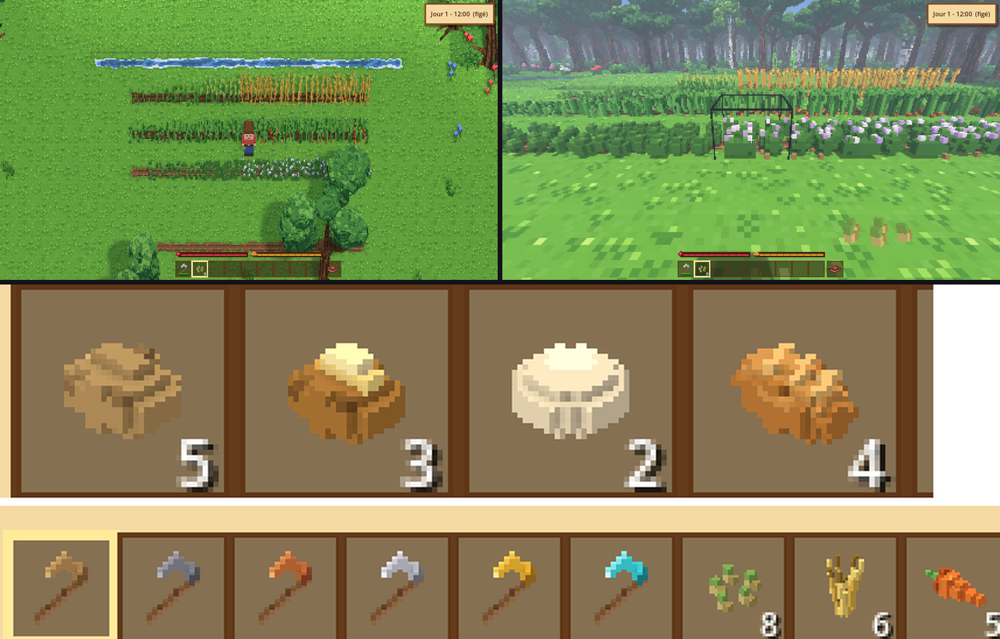

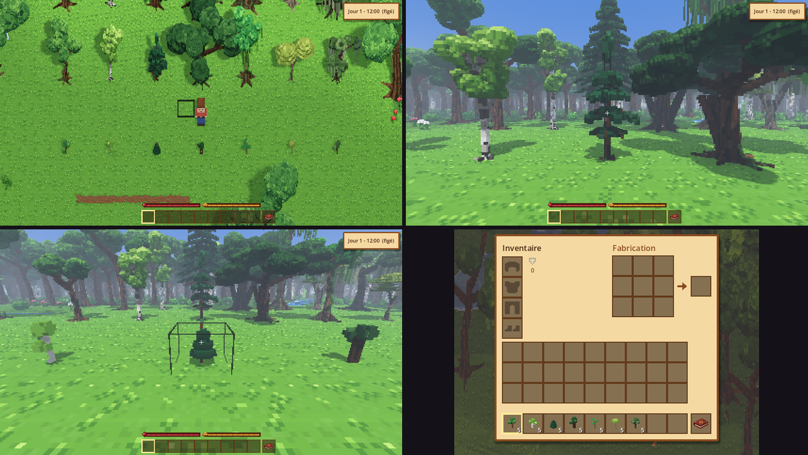

### Phase 6 : souterrain et structures (en pause : la suite viendra après la phase 7)

| Fonction | État |
|---|---|
| Maison et jardin : support mural de torche et rideaux accrochés au mur, fenêtre, vitre, évier, toilettes, table, chaise, barrières qui se raccordent, portillon et portail (ouverts et fermés avec E), feu de camp qui éclaire et éloigne les monstres ; chapitre du livre | ✅ |
| Fondations : des dizaines de milliers de sortes de blocs possibles (identifiants sur 16 bits), 255 textures de cubes ; les mondes existants se chargent tels quels | ✅ |
| Torches (au sol, dans un support mural) et lanternes (au sol, au mur, suspendues au plafond) : elles éclairent, leurs flammes vacillent, elles tiennent les monstres à distance | ✅ |
| Lumière des grottes : le jour entre par les ouvertures et faiblit à chaque pas ; sans lumière, le fond d'une grotte est noir (la lanterne, les torches et la lave éclairent) ; les monstres sortent selon la lumière | ✅ |
| Coulées d'eau et de lave : une poche ouverte s'écoule (l'eau à 4 cases, la lave à 2, cascades à chaque à-pic), sèche une fois coupée de sa source ; eau + lave = pierre | ✅ |
| Profondeurs, ruines, donjons, mines, villages | à venir |

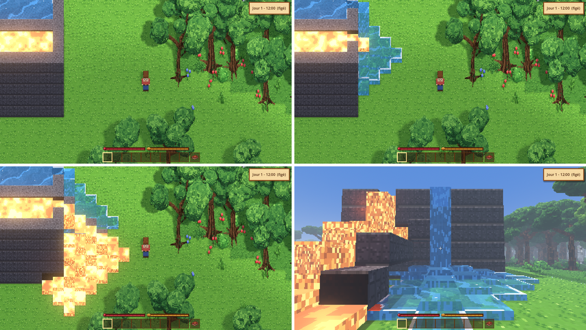

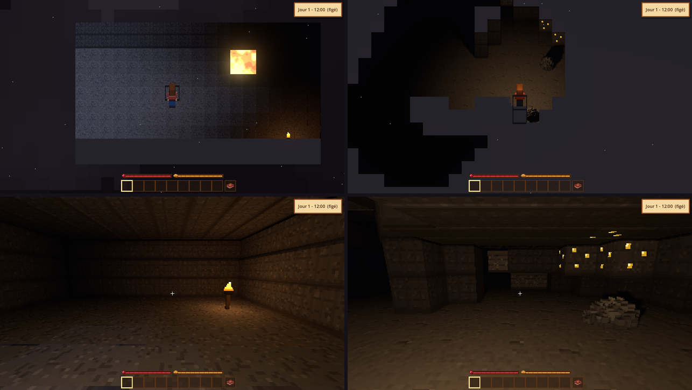

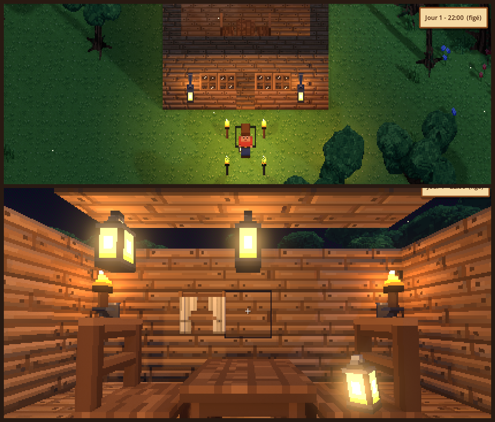

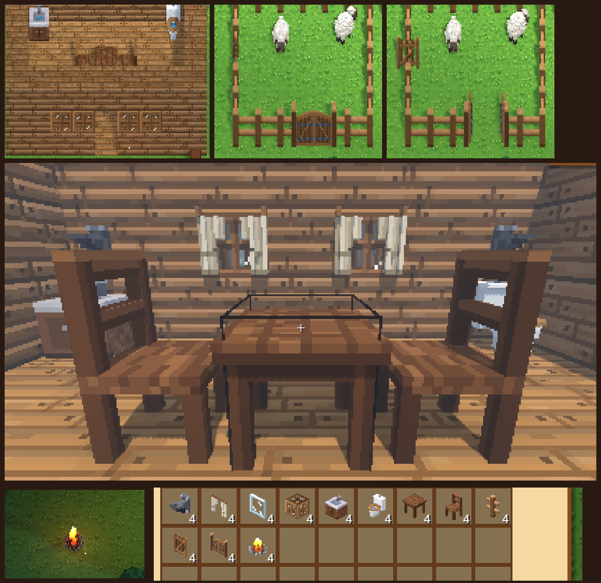

### Phase 5 : survie et combat (terminée)

| Fonction | État |
|---|---|
| Vitalité : une jauge au-dessus de la barre ; les chutes de plus de 3 niveaux (sauf dans l'eau) et la lave blessent ; la vitalité revient doucement ; à zéro, on perd connaissance, ses affaires restent sur place et on se relève au point d'apparition | ✅ |
| Faim et nourriture : une jauge de satiété qui baisse avec le temps, la marche et le minage ; manger en maintenant le clic droit (le ragoût et les baies déshydratées nourrissent bien mieux que le cru ; le champignon rouge cru rend malade) ; la vitalité ne revient que bien nourri, la faim l'use ; chapitre « Survie » du livre | ✅ |
| Nage et noyade : on coule, on remonte et on flotte en maintenant Saut, on bondit hors de l'eau contre une berge ; une jauge de souffle sous l'eau, puis on se noie ; l'eau amortit les chutes | ✅ |
| Modes de jeu : Créatif (vol, catalogue de tous les objets, blocs illimités, casse instantanée, outils de debug), Survie, Hardcore (une seule vie, puis spectateur) ; au menu pause et `--game-mode` | ✅ |
| Animaux en voxel animé (moutons, sangliers, poules sauvages, cerfs) selon les biomes : troupeaux, chemins sur le relief, fuite quand on les frappe, laine, viandes à rôtir, plumes, peaux | ✅ |
| Monstres originaux la nuit et dans le noir (phalène-lanterne, rôdeur d'ombre, faux-rocher, feu follet) : la lumière les tient à distance, coups et recul, ce qu'ils laissent | ✅ |
| Combat et armures : épées des 6 matériaux, coups qui repoussent (courte invincibilité), arc et flèches (maintenir le clic droit pour bander, tir en cloche vers la souris, flèches à ramasser), armures en peau, cuivre, fer, or et diamant portées en voxel (4 cases dans l'inventaire, jauge de protection, elles réduisent les coups des monstres et s'usent) | ✅ |

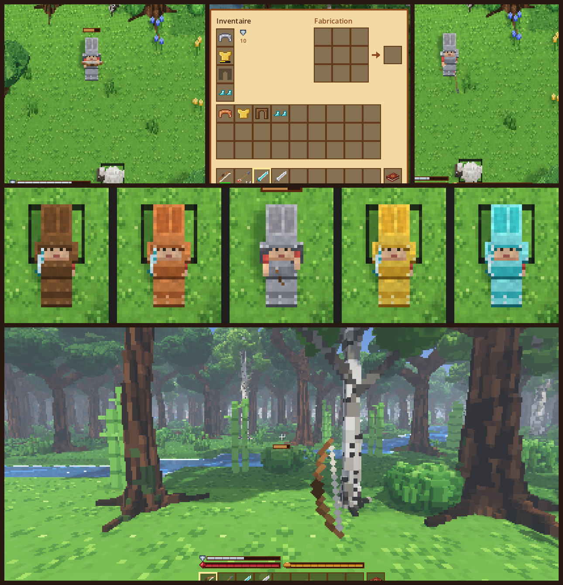

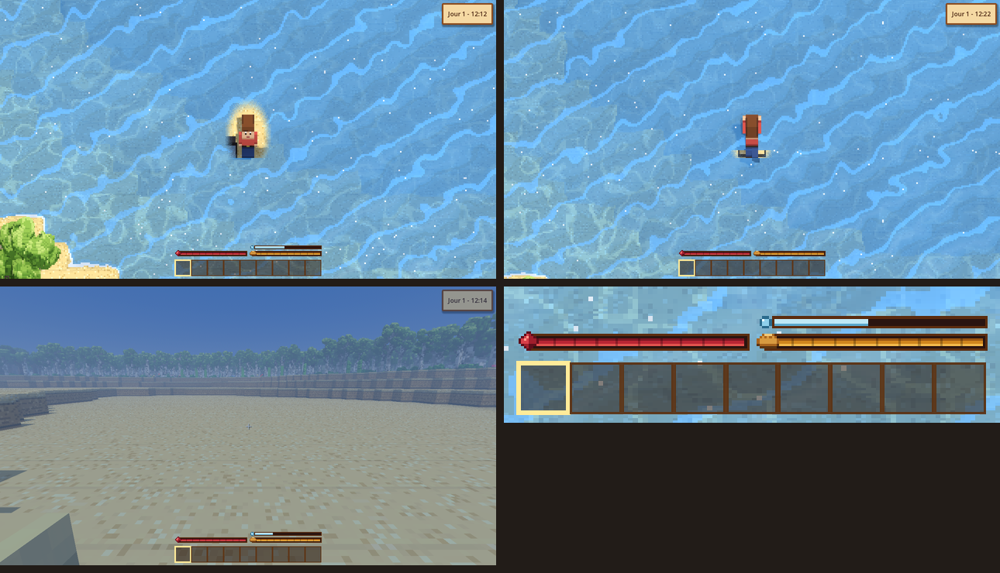

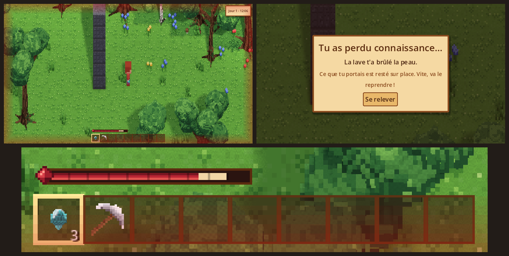

### Phase 4 : craft (terminée)

| Fonction | État |
|---|---|
| Recettes comme Minecraft (forme placée n'importe où dans la grille, ou sans forme), grille de fabrication 3×3 dans l'inventaire : bûches → planches (6 bois), bâtons, établi ; Maj + clic pour en faire le plus possible ; les recettes s'affichent dans le livre | ✅ |
| Planches des 6 bois : blocs à poser, en pixel art | ✅ |
| Établi : un vrai établi de menuisier en 3D voxel sur 2 cases (étau, tiroirs, porte, une enclume, un marteau et une scie en fer dessus), posé face au joueur | ✅ |
| Établi : clic droit dessus pour sa grille 5×5 ; les 18 outils (pioche, hache, pelle en bois, pierre, cuivre, fer, or, diamant) avec les formes de Minecraft ; lingots de cuivre, de fer et d'or (le four viendra) | ✅ |
| Usure des outils : chaque matériau a sa solidité (l'or rapide mais fragile), barre d'usure sous l'icône, l'outil se casse quand il est usé | ✅ |
| Coffres : 27 cases, ouverts au clic droit, gardés avec le monde ; cassés, ils répandent leur contenu | ✅ |
| Four alimentaire (four à pain : baies déshydratées, ragoût de champignons ; du minerai le casse) et four d'usine (lingots de cuivre, fer et or, charbon de bois ; la nourriture y carbonise), combustibles, cuisson au fil du temps, feu qui éclaire | ✅ |
| Blocs de construction : briques de pierre, briques d'ardoise, grès taillé, briques (brique cuite au four), pierre lisse, verre transparent (sable au four d'usine) | ✅ |
| Confort : nom de l'objet survolé (inventaire et livre), glisser une pile au clic droit (un par case) ou gauche (parts égales), double-clic pour rassembler une ressource éparpillée, monter sur les meubles, cadre de visée fin en 1re personne | ✅ |

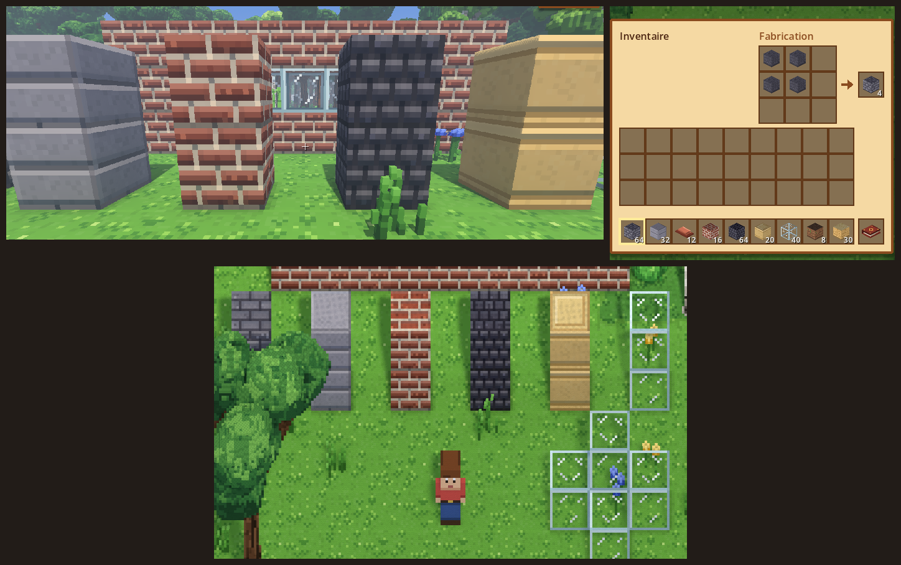

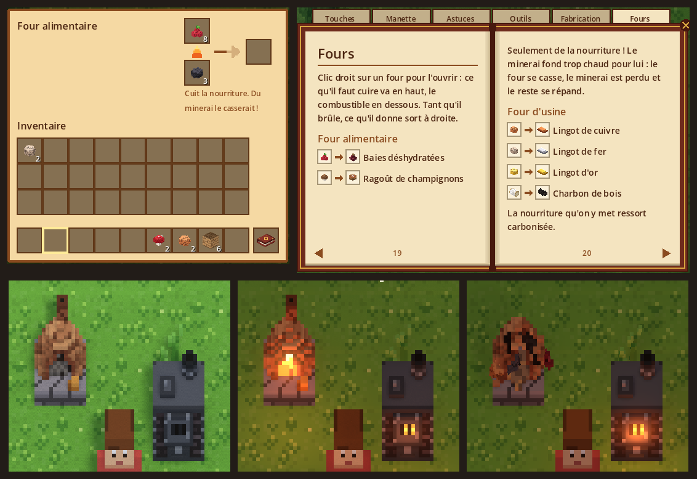

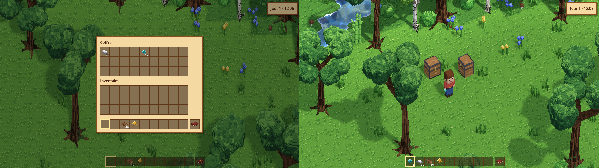

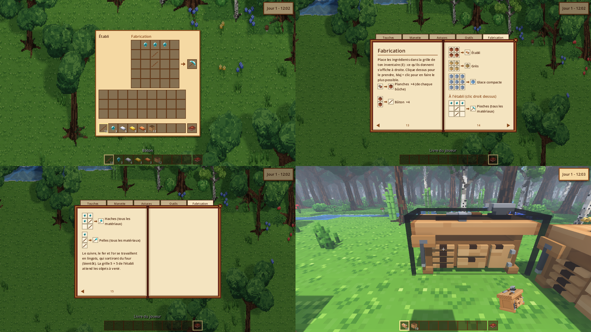


### Phase 2 : le monde en 3D pixel art

| Fonction | État |
|---|---|
| Rendu 3D : blocs, falaises et murs de roche en vrais cubes texturés en pixel art | ✅ |
| Tout en 3D voxel (1 voxel = 1 pixel) : joueur animé, 8 sortes d'arbres, buissons, herbes, fleurs, cannes à sucre, champignons, cactus, rochers | ✅ |
| Vue par défaut « pixel parfait » : chaque pixel du dessin = un pixel à l'écran, défilement fluide | ✅ |
| Caméra orbitale : tourner et incliner la vue autour du joueur à la souris ou à la manette, jusqu'à une vue presque à l'horizontale sans déformer les objets | ✅ |
| Vue à la 1re personne : automatique en entrant dans une grotte (désactivable dans le menu pause), ou à tout moment avec V ; la caméra plonge dans la tête du joueur ; C maintenu zoome | ✅ |
| Vraies ombres, occlusion ambiante, feuillages translucents qui ondulent au vent | ✅ |
| Les arbres et les falaises deviennent transparents autour du joueur quand ils le cachent | ✅ |
| Soleil et lune qui traversent le ciel, ombres longues le matin et le soir, phases de la lune | ✅ |
| Lanterne du joueur la nuit et sous terre, lave lumineuse, minerais brillants | ✅ |
| Météo : pluie, orage avec éclairs, neige selon le biome, sol mouillé, ombres des nuages | ✅ |
| Ambiance : brume du matin, brume dans les vallées, lucioles, feuilles au vent, poussière des grottes | ✅ |
| Eau animée (vagues, écume sur les rives, reflets), lave animée | ✅ |
| Eau transparente : on voit le fond, de moins en moins avec la profondeur (eaux tropicales très claires, marais troubles), le fond ondule sous les vagues, reflets de lumière dans les bas-fonds | ✅ |
| Qualité graphique Bas / Moyen / Élevé / Ultra, rendu HD et limite d'images par seconde dans le menu pause | ✅ |
| Modèles simplifiés quand on dézoome très loin, hors de l'écran et au loin (plus tôt en qualité Bas/Moyen), rendu suspendu pendant la pause | ✅ |
| Saut d'un bloc, chutes, blocs de pierre sur lesquels on peut monter (comme Minecraft) | ✅ |


### Phase 3 : joueur et interactions

| Fonction | État |
|---|---|
| Monde en vrais voxels 3D comme Minecraft : 128 blocs de haut, grottes 3D sous la surface (salles, tunnels, lacs, lave, filons de minerai) | ✅ |
| Vue en coupe sous terre : tout ce qui dépasse la tête du joueur est coupé, la roche coupée en sombre | ✅ |
| 1re personne dans les grottes (ou avec V) : plongée de la caméra, ciel, brume au loin, lanterne à la main | ✅ |
| Grands arbres détaillés, tous différents (8 versions par espèce, troncs plus ou moins hauts et épais) : troncs penchés sur leurs racines, branches fourchues, feuillage éclairé par le haut, écorce sillonnée et moussue | ✅ |
| On circule toujours entre les arbres, même en forêt dense : seul le tronc bloque, jamais deux arbres ou rochers côte à côte | ✅ |
| Sauvegarde du monde et du joueur : toutes les 2 minutes, en ouvrant le menu pause et en quittant ; on reprend là où on était, à la même heure | ✅ |
| Viser, miner, poser des blocs : clic gauche maintenu pour miner (fissures, éclats, un arbre abattu tombe), clic droit pour poser ; à la souris en vue de dessus, au viseur à la 1re personne, à la manette | ✅ |
| Objets et inventaire : chaque bloc cassé donne son objet (l'herbe de la terre, un arbre ses bûches…), objets en 3D voxel qui tombent au sol et se ramassent en passant, barre de 9 objets (molette, 1 à 9), inventaire de 27 cases (E), lancer (Q), objet tenu en main | ✅ |
| Livre du joueur : une 10e case à part (touche 0), avec un livre qu'on ne peut ni jeter ni déplacer ; il s'ouvre (clic droit, ou 0 de nouveau) sur les touches (celles de ton clavier), la manette, des astuces, les outils et bientôt les recettes ; se masque dans le menu pause | ✅ |
| Outils : pioche, hache et pelle en 6 matériaux (bois, pierre, cuivre, fer, or, diamant), en 3D voxel, tenus en main en vue de dessus comme à la 1re personne ; chaque bloc a sa dureté et son outil (la pioche pour la pierre et les minerais, la pelle pour la terre et le sable, la hache pour les arbres), un meilleur matériau mine plus vite ; F7 donne des outils en attendant le craft | ✅ |


### Phase 1 : un monde généré comme Minecraft

| Fonction | État |
|---|---|
| 5 paramètres climatiques de Minecraft (continentalité, érosion, bizarrerie, température, humidité) | ✅ |
| Relief par courbes (océans, côtes, plaines, collines, montagnes enneigées), rivières au fond des vallées | ✅ |
| 33 biomes de surface choisis comme dans Minecraft (table température × humidité, plateaux, pentes, pics) | ✅ |
| Paliers de hauteur avec falaises, qu'on gravit en sautant d'un niveau à la fois | ✅ |
| Végétation par biome : 8 sortes d'arbres, fleurs en massifs, cactus, champignons géants, cannes à sucre… | ✅ |
| Affleurements rocheux en montagne, avec charbon, fer, cuivre et émeraudes visibles | ✅ |
| Sous-sol : grandes salles, tunnels, lacs, lave, pierre puis ardoise profonde (en vraies grottes 3D depuis la phase 3) | ✅ |
| 7 minerais répartis par profondeur (charbon, cuivre, fer, or, lapis, rubis, diamant) | ✅ |
| Génération en parallèle sur tous les cœurs du processeur | ✅ |
| Carte de debug (M), descente dans la grotte suivante (Page ↓ / Page ↑), mode fantôme (F4) | ✅ (outils de debug) |


### Phase 0 : fondations

| Fonction | État |
|---|---|
| Architecture « serveur intégré » (solo), prête pour le multijoueur | ✅ |
| Monde infini découpé en chunks de 16×16 tuiles, chargés autour du joueur | ✅ |
| Déplacement du joueur avec collisions, clavier (ZQSD/WASD, flèches) et manette | ✅ |
| Caméra fluide, pixel art net, zoom (+ / -) | ✅ |
| Horloge du monde : durée de journée 5 à 120 min, synchronisation avec l'appareil, temps figé | ✅ |
| Rythme de la faim, de la cuisson et des cultures adapté à la durée des journées | ✅ (formule prête, utilisée à partir des phases 4 à 7) |
| Rattrapage hors-ligne en mode synchronisé (limité à 1 journée) | ✅ (l'horloge reprend à l'heure de l'appareil ; cultures, fours… rattrapés avec les phases 4 à 7) |
| Menu pause (temps, langue, zoom), horloge à l'écran, écran de debug (F3) | ✅ |
| Tests automatiques et compilation Windows / Linux / macOS par GitHub | ✅ |

## Jouer

**Version compilée :** onglet *Actions* du dépôt GitHub → dernière exécution de *Build* → section
*Artifacts* : `Leguitz-windows`, `Leguitz-linux` ou `Leguitz-macos`.
Sur macOS, la version n'est pas encore signée : faire clic droit → *Ouvrir* au premier lancement.

**Depuis les sources :** installer [Godot 4.7](https://godotengine.org/download), ouvrir le dossier
du projet, puis appuyer sur F5.

### Contrôles

| Action | Clavier | Manette |
|---|---|---|
| Se déplacer | ZQSD (AZERTY) / WASD (QWERTY), flèches | Stick gauche, croix |
| Courir | Maj | Clic du stick gauche |
| Sauter (1 bloc de haut) | Espace | A |
| Nager vers le haut (maintenir), sortir de l'eau contre une berge | Espace | A |
| Pause | Échap | Start |
| Tourner / incliner la caméra | Glisser avec le clic droit (ou la molette enfoncée) | Stick droit |
| Vue à la 1re personne / vue de dessus | V (souris pour regarder autour) | X (stick droit) |
| Zoomer (1re personne, maintenir) | C | |
| Revenir à la vue par défaut | Début (Home) | Clic du stick droit |
| Miner (maintenir), frapper une créature | Clic gauche | Gâchette droite |
| Poser le bloc en main | Clic droit | Gâchette gauche |
| Labourer (houe en main), semer sur la terre labourée (graines, carotte, pomme de terre en main) | Clic droit | Gâchette gauche |
| Remplir l'arrosoir (en visant l'eau ou un évier), arroser la terre labourée, répandre du compost sur une culture ou une pousse | Clic droit | Gâchette gauche |
| Mettre un déchet végétal dans le composteur, en sortir le compost | Clic droit ou E | Gâchette gauche ou B |
| Manger (nourriture en main) | Maintenir le clic droit | Maintenir la gâchette gauche |
| Bander l'arc (arc en main), relâcher pour tirer | Maintenir le clic droit | Maintenir la gâchette gauche |
| Utiliser le bloc visé (ouvrir un établi, un coffre, un four) | E | B |
| Choisir l'objet en main | Molette, 1 à 9 | RB / LB |
| Inventaire | Tab | |
| Prendre le livre du joueur, puis l'ouvrir | 0, puis 0 ou clic droit | LB / RB, puis LT |
| Lancer l'objet en main (avec Ctrl : toute la pile) | A (AZERTY) / Q (QWERTY) | |
| Zoom (vue de dessus) | Molette en gardant le clic molette enfoncé, Ctrl + molette, + / - | |
| Carte (debug) : ouvrir, dézoomer, fermer | M | Y |
| Écran de debug | F3 | Select |
| Descendre dans la grotte suivante / remonter (debug) | Page ↓ / Page ↑ | |
| Mode fantôme, traverse tout (debug) | F4 | |
| Changer la météo (debug) | F6 | |
| Donner des outils, le matériau suivant à chaque appui (debug) | F7 | |

Les outils de debug seront réservés au mode Créatif quand les modes de jeu arriveront (phase 5).

## Développement

```bash
bash tools/install_godot.sh --templates desktop   # installe Godot dans ~/godot
export PATH="$HOME/godot:$PATH"

godot --headless --path . --import                # prépare le projet
godot --headless --path . -s res://tests/run_tests.gd   # tests unitaires
gdlint src tests && gdformat --check src tests    # style (pip install "gdtoolkit==4.*")
python3 tools/gen_art.py                          # régénère les textures du terrain (+ normales)
godot --headless --path . -s res://tools/gen_models.gd  # régénère les modèles 3D voxel

# Carte d'un monde en PNG + statistiques des biomes (+ vitesse de génération)
godot --headless --path . -s res://tools/render_world_map.gd -- --seed=42 --size=512 --scale=8 --out=/tmp/carte.png --bench
```

Des options de développement se passent après `--` (graine, heure, capture d'écran…) :
voir `src/core/dev_options.gd`. Exemple :

```bash
godot --path . -- --seed=42 --time=21 --debug --lang=fr
godot --path . -- --seed=42 --descend=1               # directement dans une grotte
godot --path . -- --seed=42 --weather=thunder --camera=30,45 --quality=3   # orage, vue tournée
```

### Organisation du code

```
src/core/     constantes, coordonnées, hachage déterministe, réglages, contrôles
src/sim/      simulation autoritaire (« serveur ») : monde, chunks, horloge
src/sim/world/generation/   génération : climat, relief, biomes, surface, grottes, carte
src/net/      messages et transports (local en solo, réseau plus tard)
src/client/   affichage : rendu 3D (render/), shaders, lumière, météo, joueur
src/ui/       interface : thème, horloge, menu pause, écran de debug
scenes/       scènes Godot
tests/        tests unitaires (lanceur maison, sans dépendance)
tools/        scripts (installation de Godot, génération des sprites)
i18n/         traductions (strings.csv : clé, en, fr)
```

Le client ne modifie jamais le monde directement : il envoie des messages au serveur
(`src/net/msg.gd`), comme dans Minecraft. En solo, le serveur tourne dans le même processus.
Pour le multijoueur, il suffira de brancher un transport réseau.

## Feuille de route

0. ✅ Fondations
1. ✅ Génération du monde à la Minecraft (bruits climatiques, biomes, rivières, falaises, grottes, minerais)
2. ✅ Visuels et lumière en 3D pixel art (ombres, jour/nuit, eau, vent, météo, caméra orbitale)
3. ✅ Joueur et interactions (minage, construction, objets, inventaire, outils, livre du joueur)
4. ✅ Craft (recettes, établi, usure, coffres, fours, blocs de construction)
5. ✅ Survie et combat (vie, faim, nage, modes de jeu, animaux, monstres, combat et armures)
6. Souterrain et structures (en pause : maison et jardin, torches et lanternes, lumière des grottes, coulées d'eau et de lave faits)
7. Agriculture et élevage (en cours : végétation qui pousse, champs et cultures, arrosage et compost,
   nouvelles cultures et arbres fruitiers, élevage, cuisine, pêche et bateaux, compagnons ; reste
   les saisons)
8. Construction et décoration (à venir, propositions validées : escaliers, dalles, toitures,
   portes et échelles, nouveaux matériaux, verre et vitres refaits et teintables, rideaux
   fermables, décoration intérieure)
9. Finitions PC (menus, sauvegardes, sons, options graphiques, Steam)
10. Mobile (iOS, Android)

En attente : le mode Arcade, scénario n°1 « Restauration » (restaurer une terre désolée avec
éoliennes, irrigateurs et purificateurs, faire revenir forêts, rivières et animaux, puis recycler
les bâtiments et continuer en survie).

Le détail de chaque étape restante, les décisions prises et la façon de reprendre le projet dans
une nouvelle conversation avec Claude sont dans [`CLAUDE-README.md`](CLAUDE-README.md).
