# Leguitz

Jeu en pixel art, en monde ouvert : **explorer, construire, admirer, survivre et combattre**.
Visuellement inspiré de *Stardew Valley* (vue du dessus inclinée), et de *Minecraft* pour la logique
de jeu : monde infini généré procéduralement, blocs, craft, survie, modes Créatif / Survie / Hardcore,
et un mode Arcade à scénarios.
Le monde est rendu en **vraie 3D pixel art** : les blocs sont de vrais cubes texturés en pixel art,
les personnages et les plantes des sprites, avec de vraies ombres et lumières.

- Moteur : **Godot 4.7** (GDScript), rendu Forward+ (Vulkan / Direct3D 12 / Metal)
- Plateformes : PC (Windows, Linux, macOS) d'abord, puis iOS et Android
- Langues : français et anglais (réglable dans le jeu)

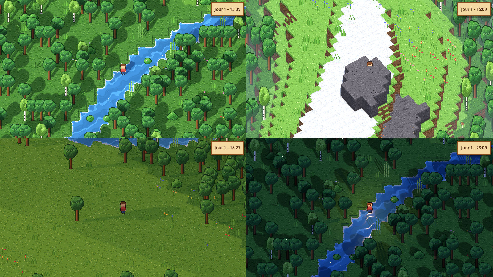

## État actuel : phase 4 (craft)

### Phase 4 : craft (en cours)

| Fonction | État |
|---|---|
| Recettes comme Minecraft (forme placée n'importe où dans la grille, ou sans forme), grille de fabrication 3×3 dans l'inventaire : bûches → planches (6 bois), bâtons, établi ; Maj + clic pour en faire le plus possible ; les recettes s'affichent dans le livre | ✅ |
| Planches des 6 bois : blocs à poser, en pixel art | ✅ |
| Établi : un vrai établi de menuisier en 3D voxel sur 2 cases (étau, tiroirs, porte, une enclume, un marteau et une scie en fer dessus), posé face au joueur | ✅ |
| Établi : grille 5×5 pour fabriquer les outils et les blocs de construction | à venir |
| Usure des outils | à venir |
| Coffres | à venir |
| Four alimentaire et four d'usine | à venir |
| Blocs de construction variés (briques, verre, pierre taillée…) | à venir |

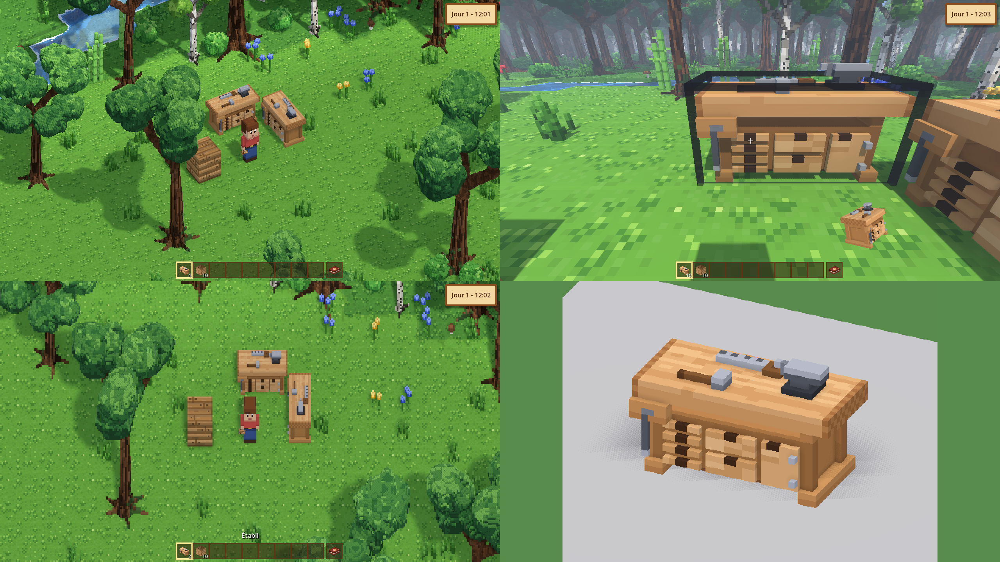

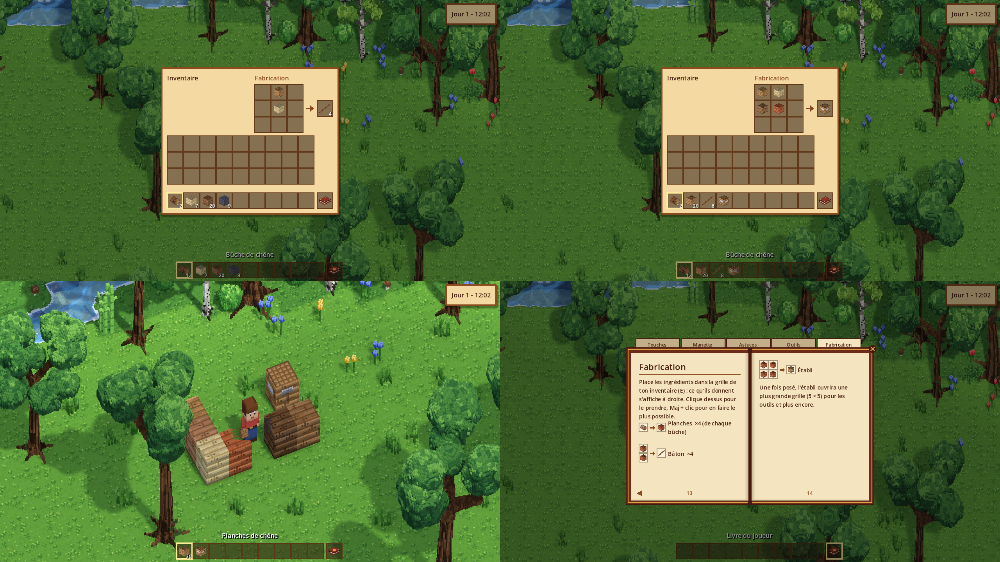

### Phase 2 : le monde en 3D pixel art

| Fonction | État |
|---|---|
| Rendu 3D : blocs, falaises et murs de roche en vrais cubes texturés en pixel art | ✅ |
| Tout en 3D voxel (1 voxel = 1 pixel) : joueur animé, 8 sortes d'arbres, buissons, herbes, fleurs, cannes à sucre, champignons, cactus, rochers | ✅ |
| Vue par défaut « pixel parfait » : chaque pixel du dessin = un pixel à l'écran, défilement fluide | ✅ |
| Caméra orbitale : tourner et incliner la vue autour du joueur à la souris ou à la manette, jusqu'à une vue presque à l'horizontale sans déformer les objets | ✅ |
| Vue à la 1re personne : automatique en entrant dans une grotte (désactivable dans le menu pause), ou à tout moment avec F5 ; la caméra plonge dans la tête du joueur | ✅ |
| Vraies ombres, occlusion ambiante, feuillages translucents qui ondulent au vent | ✅ |
| Les arbres et les falaises deviennent transparents autour du joueur quand ils le cachent | ✅ |
| Soleil et lune qui traversent le ciel, ombres longues le matin et le soir, phases de la lune | ✅ |
| Lanterne du joueur la nuit et sous terre, lave lumineuse, minerais brillants | ✅ |
| Météo : pluie, orage avec éclairs, neige selon le biome, sol mouillé, ombres des nuages | ✅ |
| Ambiance : brume du matin, brume dans les vallées, lucioles, feuilles au vent, poussière des grottes | ✅ |
| Eau animée (vagues, écume sur les rives, reflets), lave animée | ✅ |
| Eau transparente : on voit le fond, de moins en moins avec la profondeur (eaux tropicales très claires, marais troubles), le fond ondule sous les vagues, reflets de lumière dans les bas-fonds | ✅ |
| Qualité graphique Bas / Moyen / Élevé / Ultra, rendu HD et limite d'images par seconde dans le menu pause | ✅ |
| Modèles simplifiés quand on dézoome très loin, hors de l'écran et au loin (plus tôt en qualité Bas/Moyen), rendu suspendu pendant la pause | ✅ |
| Saut d'un bloc, chutes, blocs de pierre sur lesquels on peut monter (comme Minecraft) | ✅ |

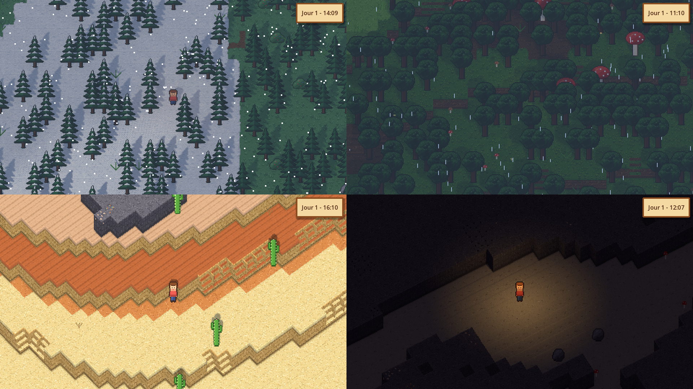

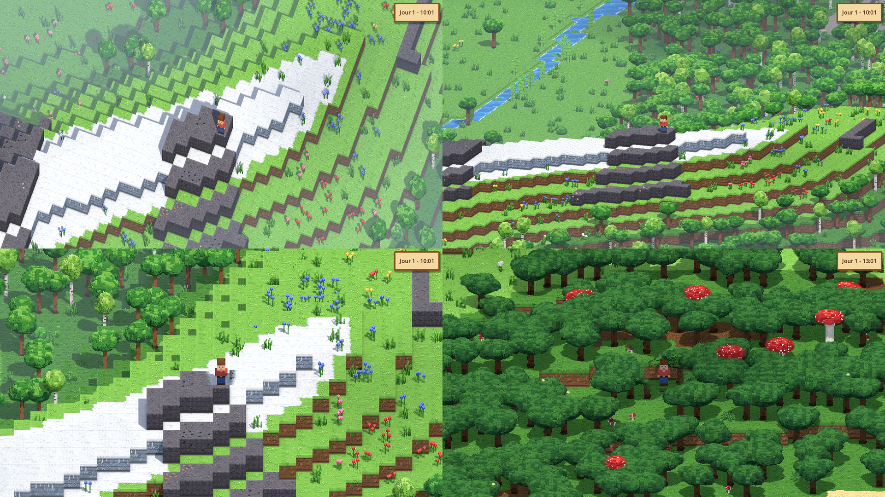

### Phase 3 : joueur et interactions

| Fonction | État |
|---|---|
| Monde en vrais voxels 3D comme Minecraft : 128 blocs de haut, grottes 3D sous la surface (salles, tunnels, lacs, lave, filons de minerai) | ✅ |
| Vue en coupe sous terre : tout ce qui dépasse la tête du joueur est coupé, la roche coupée en sombre | ✅ |
| 1re personne dans les grottes (ou avec F5) : plongée de la caméra, ciel, brume au loin, lanterne à la main | ✅ |
| Grands arbres détaillés, tous différents (8 versions par espèce, troncs plus ou moins hauts et épais) : troncs penchés sur leurs racines, branches fourchues, feuillage éclairé par le haut, écorce sillonnée et moussue | ✅ |
| On circule toujours entre les arbres, même en forêt dense : seul le tronc bloque, jamais deux arbres ou rochers côte à côte | ✅ |
| Sauvegarde du monde et du joueur : toutes les 2 minutes, en ouvrant le menu pause et en quittant ; on reprend là où on était, à la même heure | ✅ |
| Viser, miner, poser des blocs : clic gauche maintenu pour miner (fissures, éclats, un arbre abattu tombe), clic droit pour poser ; à la souris en vue de dessus, au viseur à la 1re personne, à la manette | ✅ |
| Objets et inventaire : chaque bloc cassé donne son objet (l'herbe de la terre, un arbre ses bûches…), objets en 3D voxel qui tombent au sol et se ramassent en passant, barre de 9 objets (molette, 1 à 9), inventaire de 27 cases (E), lancer (Q), objet tenu en main | ✅ |
| Livre du joueur : une 10e case à part (touche 0), avec un livre qu'on ne peut ni jeter ni déplacer ; il s'ouvre (clic droit, ou 0 de nouveau) sur les touches (celles de ton clavier), la manette, des astuces, les outils et bientôt les recettes ; se masque dans le menu pause | ✅ |
| Outils : pioche, hache et pelle en 6 matériaux (bois, pierre, cuivre, fer, or, diamant), en 3D voxel, tenus en main en vue de dessus comme à la 1re personne ; chaque bloc a sa dureté et son outil (la pioche pour la pierre et les minerais, la pelle pour la terre et le sable, la hache pour les arbres), un meilleur matériau mine plus vite ; F7 donne des outils en attendant le craft | ✅ |

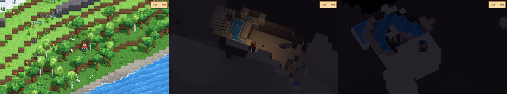

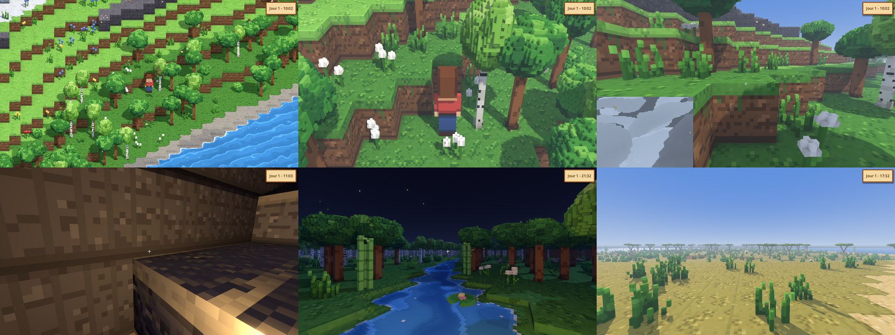

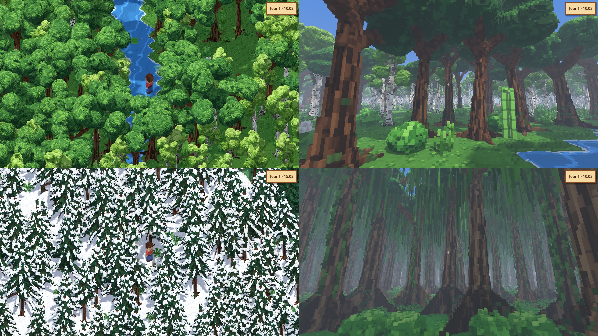

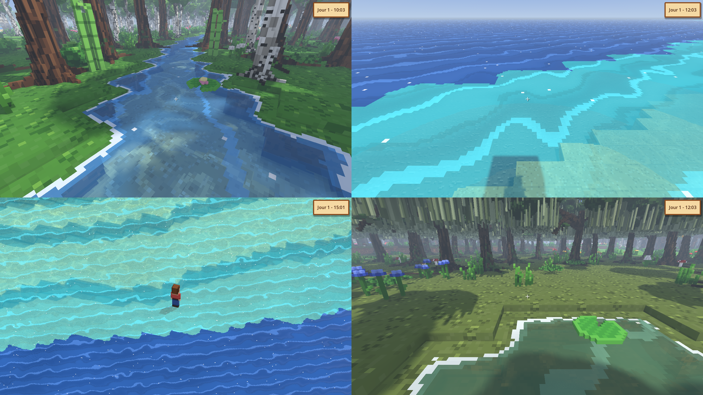

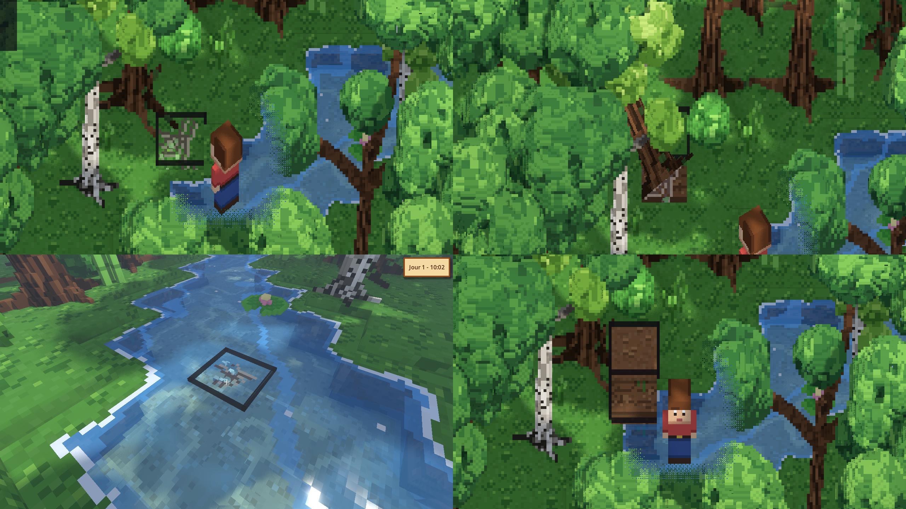

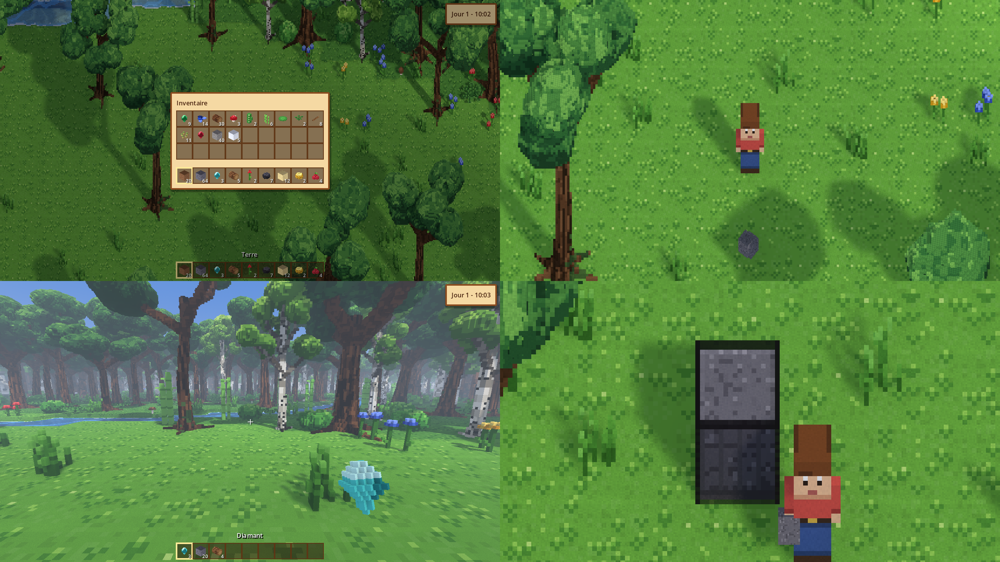

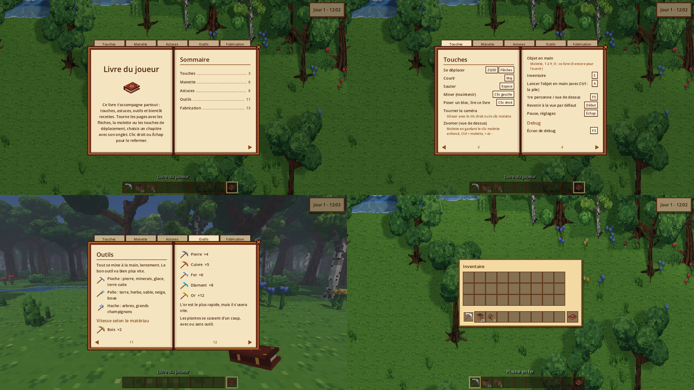

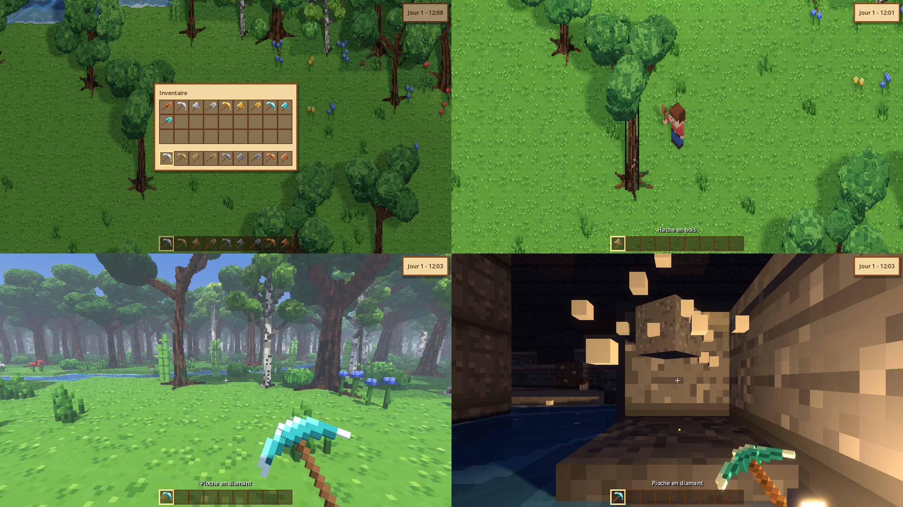

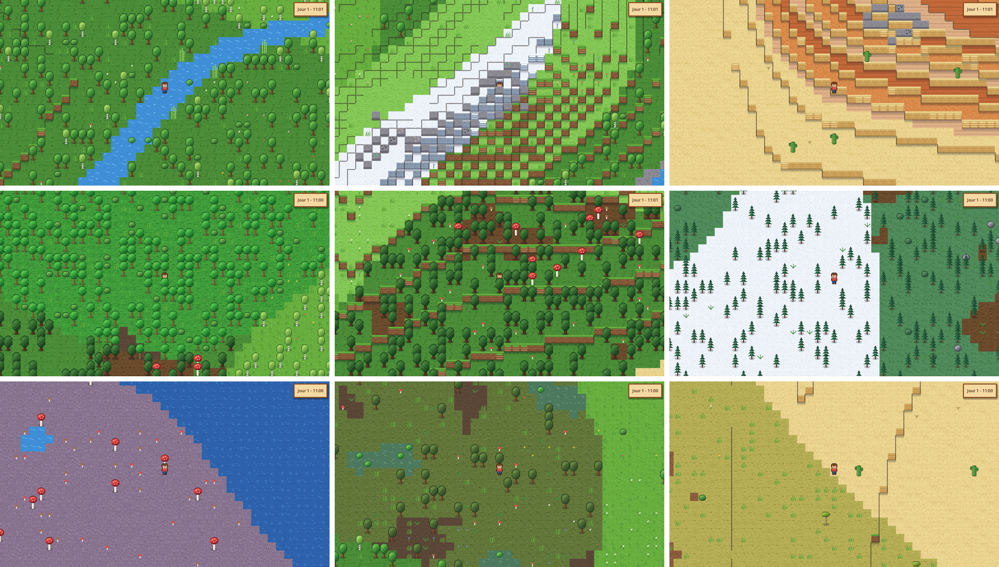

### Phase 1 : un monde généré comme Minecraft

| Fonction | État |
|---|---|
| 5 paramètres climatiques de Minecraft (continentalité, érosion, bizarrerie, température, humidité) | ✅ |
| Relief par courbes (océans, côtes, plaines, collines, montagnes enneigées), rivières au fond des vallées | ✅ |
| 33 biomes de surface choisis comme dans Minecraft (table température × humidité, plateaux, pentes, pics) | ✅ |
| Paliers de hauteur avec falaises, qu'on gravit en sautant d'un niveau à la fois | ✅ |
| Végétation par biome : 8 sortes d'arbres, fleurs en massifs, cactus, champignons géants, cannes à sucre… | ✅ |
| Affleurements rocheux en montagne, avec charbon, fer, cuivre et émeraudes visibles | ✅ |
| Sous-sol : grandes salles, tunnels, lacs, lave, pierre puis ardoise profonde (en vraies grottes 3D depuis la phase 3) | ✅ |
| 7 minerais répartis par profondeur (charbon, cuivre, fer, or, lapis, rubis, diamant) | ✅ |
| Génération en parallèle sur tous les cœurs du processeur | ✅ |
| Carte de debug (M), descente dans la grotte suivante (Page ↓ / Page ↑), mode fantôme (F4) | ✅ (outils de debug) |

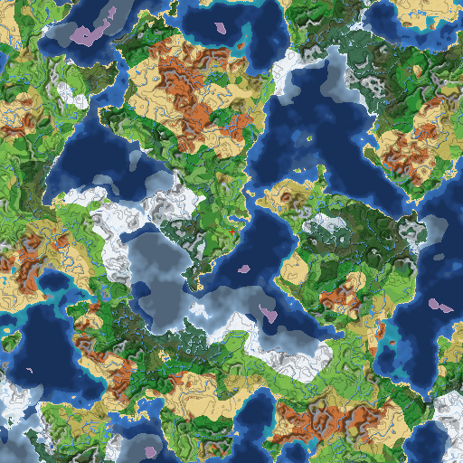

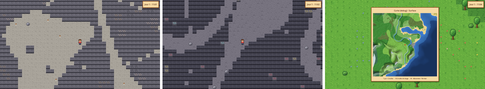

### Phase 0 : fondations

| Fonction | État |
|---|---|
| Architecture « serveur intégré » (solo), prête pour le multijoueur | ✅ |
| Monde infini découpé en chunks de 16×16 tuiles, chargés autour du joueur | ✅ |
| Déplacement du joueur avec collisions, clavier (ZQSD/WASD, flèches) et manette | ✅ |
| Caméra fluide, pixel art net, zoom (+ / -) | ✅ |
| Horloge du monde : durée de journée 5 à 120 min, synchronisation avec l'appareil, temps figé | ✅ |
| Rythme de la faim, de la cuisson et des cultures adapté à la durée des journées | ✅ (formule prête, utilisée à partir des phases 4 à 7) |
| Rattrapage hors-ligne en mode synchronisé (limité à 1 journée) | ✅ (l'horloge reprend à l'heure de l'appareil ; cultures, fours… rattrapés avec les phases 4 à 7) |
| Menu pause (temps, langue, zoom), horloge à l'écran, écran de debug (F3) | ✅ |
| Tests automatiques et compilation Windows / Linux / macOS par GitHub | ✅ |

## Jouer

**Version compilée :** onglet *Actions* du dépôt GitHub → dernière exécution de *Build* → section
*Artifacts* : `Leguitz-windows`, `Leguitz-linux` ou `Leguitz-macos`.
Sur macOS, la version n'est pas encore signée : faire clic droit → *Ouvrir* au premier lancement.

**Depuis les sources :** installer [Godot 4.7](https://godotengine.org/download), ouvrir le dossier
du projet, puis appuyer sur F5.

### Contrôles

| Action | Clavier | Manette |
|---|---|---|
| Se déplacer | ZQSD (AZERTY) / WASD (QWERTY), flèches | Stick gauche, croix |
| Courir | Maj | Clic du stick gauche |
| Sauter (1 bloc de haut) | Espace | A |
| Pause | Échap | Start |
| Tourner / incliner la caméra | Glisser avec le clic droit (ou la molette enfoncée) | Stick droit |
| Vue à la 1re personne / vue de dessus | F5 (souris pour regarder autour) | X (stick droit) |
| Revenir à la vue par défaut | Début (Home) | Clic du stick droit |
| Miner (maintenir) | Clic gauche | Gâchette droite |
| Poser le bloc en main | Clic droit | Gâchette gauche |
| Choisir l'objet en main | Molette, 1 à 9 | RB / LB |
| Inventaire | E | |
| Prendre le livre du joueur, puis l'ouvrir | 0, puis 0 ou clic droit | LB / RB, puis LT |
| Lancer l'objet en main (avec Ctrl : toute la pile) | A (AZERTY) / Q (QWERTY) | |
| Zoom (vue de dessus) | Molette en gardant le clic molette enfoncé, Ctrl + molette, + / - | |
| Carte (debug) : ouvrir, dézoomer, fermer | M | Y |
| Écran de debug | F3 | Select |
| Descendre dans la grotte suivante / remonter (debug) | Page ↓ / Page ↑ | |
| Mode fantôme, traverse tout (debug) | F4 | |
| Changer la météo (debug) | F6 | |
| Donner des outils, le matériau suivant à chaque appui (debug) | F7 | |

Les outils de debug seront réservés au mode Créatif quand les modes de jeu arriveront (phase 5).

## Développement

```bash
bash tools/install_godot.sh --templates desktop   # installe Godot dans ~/godot
export PATH="$HOME/godot:$PATH"

godot --headless --path . --import                # prépare le projet
godot --headless --path . -s res://tests/run_tests.gd   # tests unitaires
gdlint src tests && gdformat --check src tests    # style (pip install "gdtoolkit==4.*")
python3 tools/gen_art.py                          # régénère les textures du terrain (+ normales)
godot --headless --path . -s res://tools/gen_models.gd  # régénère les modèles 3D voxel

# Carte d'un monde en PNG + statistiques des biomes (+ vitesse de génération)
godot --headless --path . -s res://tools/render_world_map.gd -- --seed=42 --size=512 --scale=8 --out=/tmp/carte.png --bench
```

Des options de développement se passent après `--` (graine, heure, capture d'écran…) :
voir `src/core/dev_options.gd`. Exemple :

```bash
godot --path . -- --seed=42 --time=21 --debug --lang=fr
godot --path . -- --seed=42 --descend=1               # directement dans une grotte
godot --path . -- --seed=42 --weather=thunder --camera=30,45 --quality=3   # orage, vue tournée
```

### Organisation du code

```
src/core/     constantes, coordonnées, hachage déterministe, réglages, contrôles
src/sim/      simulation autoritaire (« serveur ») : monde, chunks, horloge
src/sim/world/generation/   génération : climat, relief, biomes, surface, grottes, carte
src/net/      messages et transports (local en solo, réseau plus tard)
src/client/   affichage : rendu 3D (render/), shaders, lumière, météo, joueur
src/ui/       interface : thème, horloge, menu pause, écran de debug
scenes/       scènes Godot
tests/        tests unitaires (lanceur maison, sans dépendance)
tools/        scripts (installation de Godot, génération des sprites)
i18n/         traductions (strings.csv : clé, en, fr)
```

Le client ne modifie jamais le monde directement : il envoie des messages au serveur
(`src/net/msg.gd`), comme dans Minecraft. En solo, le serveur tourne dans le même processus.
Pour le multijoueur, il suffira de brancher un transport réseau.

## Feuille de route

0. ✅ Fondations
1. ✅ Génération du monde à la Minecraft (bruits climatiques, biomes, rivières, falaises, grottes, minerais)
2. ✅ Visuels et lumière en 3D pixel art (ombres, jour/nuit, eau, vent, météo, caméra orbitale)
3. ✅ Joueur et interactions (minage, construction, objets, inventaire, outils, livre du joueur)
4. Craft (recettes ✅, établi, usure, coffres, fours, blocs de construction) : en cours
5. Survie et combat (vie, faim, animaux, monstres, combat, modes de jeu)
6. Souterrain et structures
7. Agriculture et élevage
8. Mode Arcade : scénario n°1 « Restauration » (restaurer une terre désolée avec éoliennes,
   irrigateurs et purificateurs, faire revenir forêts, rivières et animaux, puis recycler les
   bâtiments et continuer en survie)
9. Finitions PC (menus, sauvegardes, sons, options graphiques, Steam)
10. Mobile (iOS, Android)

Le détail de chaque étape restante, les décisions prises et la façon de reprendre le projet dans
une nouvelle conversation avec Claude sont dans [`CLAUDE-README.md`](CLAUDE-README.md).
